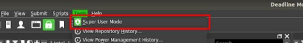
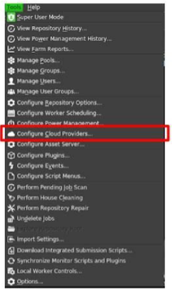
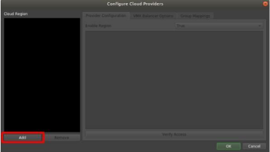
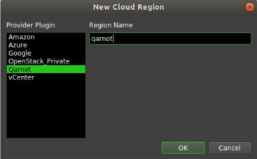
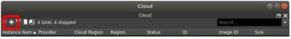
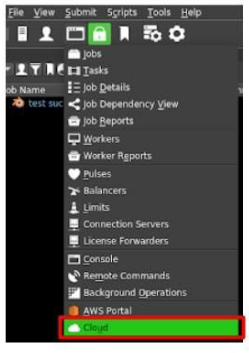
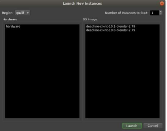

# Qarnot Cloud plugin for Deadline

The Deadline version used to build this plugin is 10.1.3.6

### Install Qarnot plugin
  * Download the Deadline Qarnot plugin.
  * Put the Deadline Qarnot plugin folder in the Repository’s *custom/cloud* and rename it *Qarnot*.
  * Install Qarnot module: *pip install --target /opt/Thinkbox/Deadline10/lib/python2.7/site-packages qarnot*

### Configure Qarnot plugin
  * Open the Monitor and enter **Super User mode**. (click on menu *Tools > Super User Mode*)  

  * Select *Tools > Configure Cloud Providers*.  

  * Click on the Add button under the Cloud Region box to choose your plugin.  

  * Select *Qarnot* Provider, enter the Region Name you want to use.  

  * Qarnot API configuration:
    * *Cluster*: Cluster of the Qarnot API (usually https://api.qarnot.com)
    * *Token*: your authentication API token. (you can retrieve it from the Qarnot Account)
    * *Enable*: True
  * To configure the Repository and License options, you need to go in the Repository, open the *[...]/DeadlineRepository10/custom/cloud/Qarnot/Qarnot.py* file and edit your parameters from line 98 to line 103.
    * *Repository configuration*: Deadline Repository url or IP address.
    * *License mode*: Standard or UsageBased.
    * *License server*: License Server Address.
    * *Use SSL for Repository Proxy*: True if use SSL.
    * *Proxy SSL Certificate*: SSL Certificate.

### Start an instance on Qarnot
  * Open the Cloud panel (click on the Panels icon, *Panels > Cloud*).  

  * Click on the “+” icon.  

  * Choose the Region, the Hardware and the OS Image (in this case, *deadline-client-10.0-blender-2.79*) and click on Launch.  

You can monitor the launched instances on the [Qarnot Console](https://console.qarnot.com).
